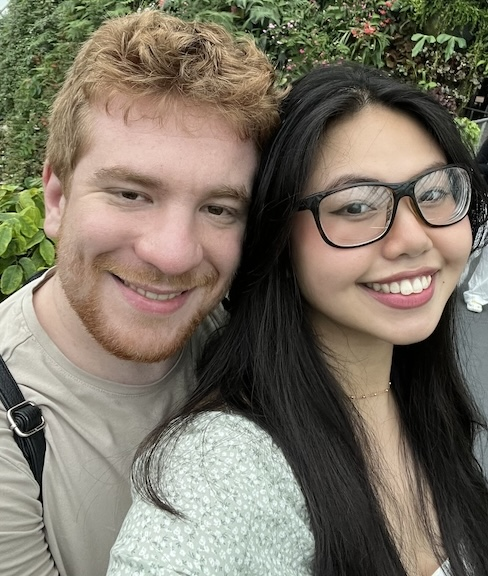

# Spencer Kraisler

University of Washington

Department of Aeronautics and Astronautics

Seattle, WA 98195

Email: kraisler (at) uw (dot) edu

[linkedin](https://www.linkedin.com/in/spencer-kraisler-250494149/)

[github](https://github.com/spencerkraisler)

[resume](https://spencerkraisler.github.io/resume.pdf)

## About me
Hi! I am a 4th year PhD student at the University of Washington. I work at the Robotics, Aerospace and Information Networks (RAIN) lab inside the Aeronautics and Astronautics department. My advisor is Mehran Mesbahi.

I have a strong passion for the intersection of application and theory. While my research is very theoretical, I make sure to ground everything in pratical application. I love seeing the interation of mathematics and hardware, especially in the context of big rockets :) 

I specialize in control theory: a math-heavy engineering discpline where system feedback is used to control that system, *closing the loop*. Going more specific, I look into topics related to GNC, policy optimization, and optimal control. Going even *more* specific, my main thesis topic will be on **controller synthesis through Riemannian optimization**. *Controller synthesis* means designing a controller in an automated way, as opposed to hand-tuning. And *Riemannian optimization* is a toolkit from optimization theory used when your search space is constrained in a *smooth non-degenerate* way. 

Outside of work, my wife and I are huge foodies and love exploring the Seattle region for delicious restaurants. I alos love to hike, read, attend music venues. I also train Shotorkan karate (2nd degree black belt) and recently took up [curling](https://en.wikipedia.org/wiki/Curling) as a hobby. 

<!--  -->

## Projects

[using policy optimization to design optimal controllers](projects/direct_policy_optimization.md)

[steering dynamic agents towards a single point on a smooth manifold](projects/distributed_geometric_consensus.md)

<!-- ### Manopt contributions
I contributed a small amount of code to the [Manopt library](https://github.com/NicolasBoumal/manopt). Manopt is a Matlab toolbox for optimization on manifolds I use pretty often. I added a method that returns the Lie identity for Lie groups, and used [Rodrigues' rotation formula](https://en.wikipedia.org/wiki/Rodrigues%27_rotation_formula) for optimize the exp() and log() operators for SO(3). -->

<!-- ## Awards

### Recipient of CDC 2023 Travel Grant

### 3rd place in UW A&A Research Showcase 2022
I placed 3rd in UW's A&A Research Showcase 2022. Here, A&A PhD students give 3 minute presentations of their recent research. [Here](https://youtu.be/H1MZtewFQK8?t=2563) is the link to my presentation.  -->
